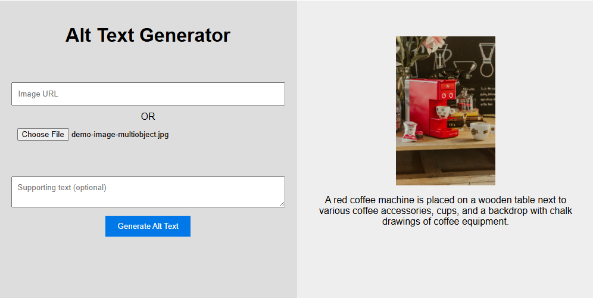
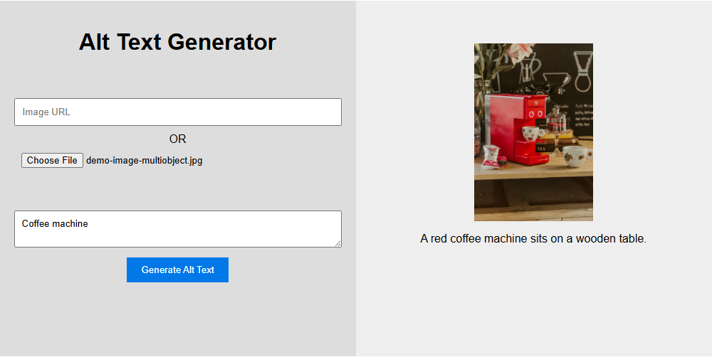

# Alt Text GenAI Demo
A small example of building an API that can take in an image and generate alt-text for it, using supporting text to focus the description.

[](https://portal.azure.com/#create/Microsoft.Template/uri/https%3A%2F%2Fraw.githubusercontent.com%2FScottHolden%2FAltTextGenAIDemo%2Fmain%2Fdeploy%2Fdeploy.generated.json)

Using traditional computer vision or machine learning models to generate alt-text for images can be difficult, especially when the image is complex or contains multiple objects. For example the following image could be described in many ways, but the focus of the image is the coffee machine:



This project uses Azure OpenAI's vision capabilities to generate alt-text for images, and allows for supporting text to be provided to focus the description on specific objects. Taking the same example as above and providing the supporting text "coffee machine":



The above UI is designed for experimentation and demonstration purposes, and can be easily disabled if you are only looking to use the API. You can find examples of how to call the API in [AltTextGenAI.http](AltTextGenAI.http).

## How it works
1. An image is uploaded (or a URL to an image is provided)
1. The image is resized
1. A predefined prompt, the image, and optional supported text are passed to GPT-4o to generate alt-text
1. The alt-text (and optionally usage information) is returned to the user

## Prompt Engineering

This project stores prompts as code, and the prompts/templates listed below can be found in [AltTextGenerator.cs](src/AltTextGenerator.cs).

The prompt is designed to be a simple, yet effective way to generate alt-text, and can be easily modified to suit different needs. The default prompt is:
```
You are an alt text generator for images. Given an image create a description of the image for a user who cannot see it.
You may also be provided with some supporting text to help you generate the alt text, if something is mentioned in the text, focus only on it in the alt text.
Keep all responses to a single sentence in length.
```
A text message is also added if any supporting text is provided. This is formatted as:
```
The image is related to: "{SupportingText}". Only mention this in the alt text, no other objects unrelated to this.
```

## Getting Started
You can either deploy this project to Azure using the button above, or run it locally using the following steps:

1. Ensure you have .NET 8.0 SDK installed
1. Clone or download the repository
1. Create a copy of `appsettings.json` and rename it to `appsettings.Development.json`, update the copy with your Azure OpenAI endpoint and deployment name (GPT-4v, GPT-4-turbo, or GPT-4o required)
1. Use `dotnet run` to start the project, you can either navigate to `http://localhost:5091` in your browser or use the [AltTextGenAI.http](AltTextGenAI.http) file to test the API

## Notes
-  It is recommended to enable Authentication if you deploy the container app to Azure, as the API is not secured by default.